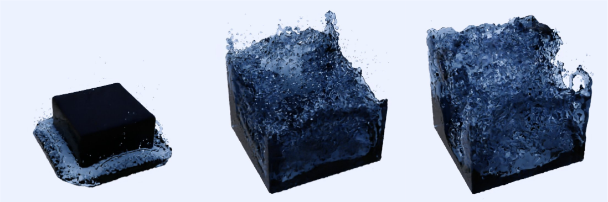
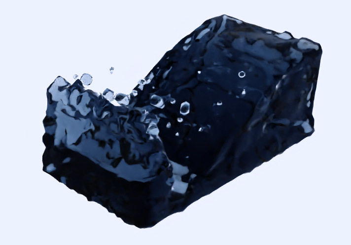
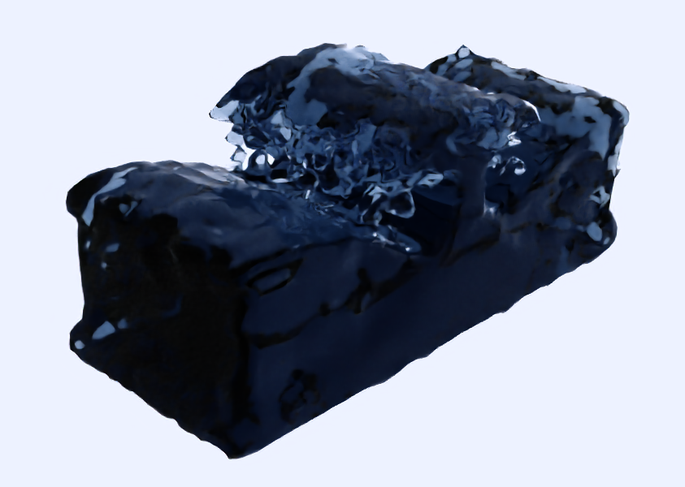

# CS 284A: Computer Graphics and Imaging, Spring 2020

## Final Project: Position Based Fluid Simulation and Surface Rendering

  

## Team Member

- Jiewen Lai
- Yanda Li
- Kailun Wan

## Abstract

In the course, we learned how to make a simulation of cloth using the mass and spring-based system with some physical constraints and numerical integration. In this final project, we extend our knowledge to make the simulation of another popular topic-fluid. We want to know how the liquid particles work with each other with some physical constraints to create the liquid effect. We used the Position Based Fluids algorithm to simulate the liquid. In addition, we implemented the novel CUDA accelerator to simulate millions of particles in seconds and real-time 60 fps simulation for thousands of particles. At last, we applied the marching cube algorithm to reconstruct the surface meshes of the liquid and rendered the images and videos with Paraview to create realistic liquid effects for particles.

## Technical Approaches

We explained our technical approaches in detail in our final report. You can find the link below in the deliverables section.

## Deliverables

For our deliverables, we have a final video to highlight the results and explain our technologies of this project at a high level. You can take a look at it from [here](https://youtu.be/SfTIv-HlWFM). And [here](https://docs.google.com/presentation/d/1VrIeeL3HWLHeoGgKl4LTh8TZWxva0XWIZIpgnCNel8A/edit?usp=sharing) is our slides to explain our ideas for this project in the video. 

We also attach our report to explain the details of our project. You can open it from [here](https://www.google.com).

Our codes for the project are released on our GitHub repo. You can find them [here](https://github.com/CTKnight/FluidSimulator).

## Final remarks

You can consult [README.md](https://github.com/CTKnight/FluidSimulator/blob/master/README.md) and [BUILDING.md](https://github.com/CTKnight/FluidSimulator/blob/master/BUILDING.md) on our repo for more related information. Thank you, and hope you like our project!

