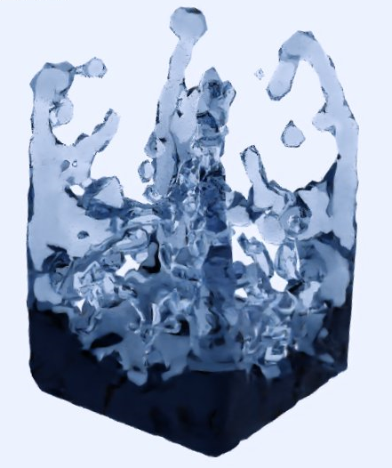

# CS 284A: Computer Graphics and Imaging, Spring 2020

## Final Project: Position Based Fluid Simulation and Surface Rendering

## Team Member

- Jiewen Lai
- Yanda Li
- Kailun Wan

## Links for our deliverables

### Final video

[link to Youtube final video](https://youtu.be/SfTIv-HlWFM)

### Slides

[link to Google final Slides](https://docs.google.com/presentation/d/1VrIeeL3HWLHeoGgKl4LTh8TZWxva0XWIZIpgnCNel8A/edit?usp=sharing)

### Report

[link to final pdf report](https://drive.google.com/file/d/14NBuwOkBv4B0xg0AGVYWsEsgpjXjXg6a/view?usp=sharing)

### Codes

[link to the source codes](https://github.com/CTKnight/FluidSimulator)

## Abstract

In the course, we learned how to make a simulation of cloth using the mass and spring-based system with some physical constraints and numerical integration. In this final project, we extend our knowledge to make the simulation of another popular topic-fluid. We want to know how the liquid particles work with each other with some physical constraints to create the liquid effect. We used the Position Based Fluids algorithm to simulate the liquid. In addition, we implemented the novel CUDA accelerator to simulate millions of particles in seconds and real-time 60 fps simulation for thousands of particles. At last, we applied the marching cube algorithm to reconstruct the surface meshes of the liquid and rendered the images and videos with Paraview to create realistic liquid effects for particles.

## Technical Approaches

We explained our technical approaches in detail in our final report. You can find the link above in the "Links for our deliverables" section.

## Deliverables

For our deliverables, here are some rendered images for our liquid surfaces:

  

In addition, we have a rendered millions of particles with simple video of dam break for our liquid cube:

  

For other deliverables, you can check the links on the top of this page.

## Final remarks

You can consult [README.md](https://github.com/CTKnight/FluidSimulator/blob/master/README.md) and [BUILDING.md](https://github.com/CTKnight/FluidSimulator/blob/master/BUILDING.md) on our repo for more related information. Thank you, and hope you like our project!

